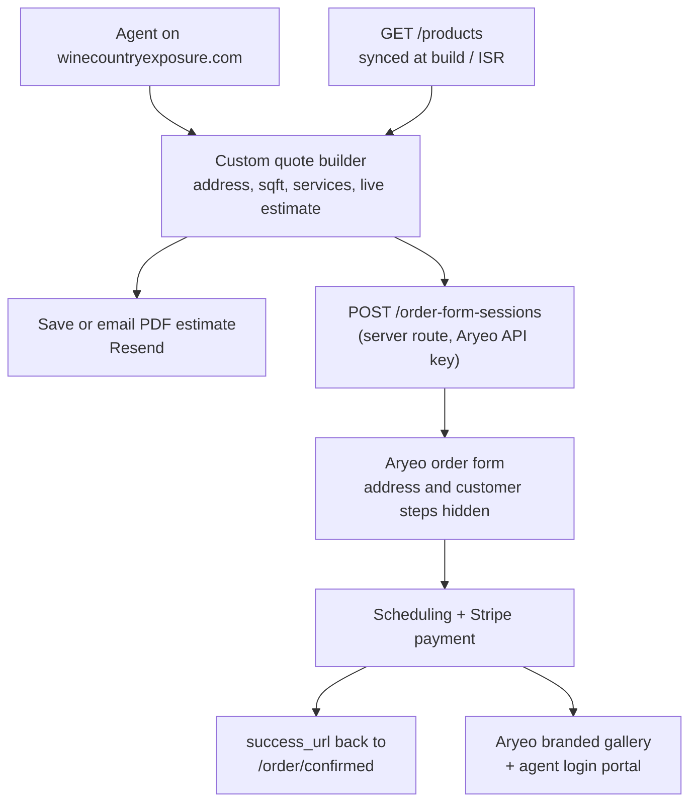

# Wine Country Exposure — Real Estate Media Site

## Overview

A Next.js 15 marketing site + custom multi-step quote builder that pre-fills and hands off to Aryeo Pro. Aryeo owns scheduling, invoicing, payment (through your own Stripe), and media delivery, so you never build a gallery system, calendar, or invoice engine. Your site owns brand, SEO, blog, and the ordering experience.

## Architecture

The `POST /order-form-sessions` endpoint is what makes this work. It accepts `order_form_id`, structured `address_data` (including lat/lng), `customer_data` (email, name, phone), `step_visibility.show_address_step` / `show_customer_step` to hide steps the agent already filled out, and a `success_url`. It returns `data.url` to redirect to.

Pricing is synced from Aryeo's `GET /products` rather than hardcoded, so the on-site estimator and the real checkout can't drift apart.

## Critical unknown to resolve first

Aryeo's docs do not publicly state which plan grants API key access, and **webhook management is explicitly feature-flagged** ("reach out to our team with your use case"). Before writing the handoff code, book the Aryeo demo and confirm in writing:

- API key access in group developer settings on **Pro Tier 1 ($49/mo)**, not Enterprise-only
- Access to `POST /order-form-sessions` and `GET /products`
- Webhook registration for `order.*` and media-delivered events

Fallback if API is Enterprise-gated: keep the custom builder as a **lead-gen estimator** that emails the quote and deep-links to Aryeo's hosted order form with query-string pre-fill, or embeds it in an iframe. Same site, same design, one less integration. Plan the builder so this swap is a single function change in `lib/aryeo/handoff.ts`.

## Tech stack

- **Next.js 15 App Router** + React 19 + TypeScript
- **Tailwind CSS v4** (same as Wine Country Harvest, so utility muscle memory carries over)
- **Framer Motion** (`motion`) for scroll/hero animation — already in your WCH deps
- **MDX blog**: `content/blog/*.mdx` read with `gray-matter` + `next-mdx-remote/rsc`. Avoid Contentlayer (unmaintained).
- **next/image** for the photo-heavy portfolio — the single biggest reason to move off the Vite SPA setup, which needed custom `scripts/prerender-pages.ts` and `scripts/validate-seo.ts` to get SEO working
- **Google Places Autocomplete (New)** for the address step, matching Open Homes. Needs a Google Cloud project with billing; restrict the key by HTTP referrer.
- **Route handlers** in `app/api/*` replace the `/api/*.ts` Vercel functions you use today

## Services and accounts needed

- **GitHub**: `atamblin/wine-country-exposure` (mirrors your existing `atamblin/Wine-Country-Harvest`)
- **Vercel**: new project, auto-deploy on push, preview URLs per branch. Budget **Pro at $20/mo** — Hobby is licensed for non-commercial use only, and this is a business site.
- **Aryeo Pro Tier 1**: $49/mo, 100 listings/yr, 1 team member
- **Stripe**: your own account, connected to Aryeo via Stripe Connect (2.9% + 30 cents)
- **Resend**: quote-PDF emails and lead notifications; verify `winecountryexposure.com`
- **Google Cloud**: Places API key
- **GA4 + Vercel Analytics**
- **Google Business Profile**: critical for "real estate photographer Santa Rosa" type searches

Recurring: roughly $70/mo plus Stripe fees and minor Places usage.

## DNS

Keep GoDaddy as registrar. In Vercel, add `winecountryexposure.com` and `www`, then enter the exact A/CNAME records Vercel displays into GoDaddy DNS (do not rely on remembered IPs — Vercel has changed them). Set `www` as the canonical redirect target, matching `VITE_SITE_URL` convention from WCH as `NEXT_PUBLIC_SITE_URL`.

## Site structure

- `/` — hero, service grid with "starting at" pricing, social proof, sample work, primary CTA to the quote builder
- `/services` and `/services/[slug]` — one page per service, each with pricing tiers, samples, FAQ
- `/quote` — the 3-step builder
- `/portfolio` — filterable gallery
- `/pricing` — packages plus square-footage tiers
- `/about`, `/contact`
- `/blog` and `/blog/[slug]`
- `/areas/[city]` — Santa Rosa, Healdsburg, Napa, Sonoma, Petaluma, Sebastopol, Windsor, St. Helena, Calistoga, Novato
- `/ab-723` — California disclosure rules for digitally altered images. Open Homes has this and it's a genuine compliance concern for virtual staging; it's cheap trust-building content that also ranks.

## Quote builder — mirroring the Open Homes flow

I walked all three steps of their form. Replicate this structure:

**Step 1 — Property.** Property-type tiles (House, Condominium, Townhouse, Lot, Multi-Unit, Commercial, Mixed-Use, Other), Google Places address autocomplete, auto-filled city/ZIP, unit number, and required estimated square footage. Square footage drives the pricing tier, so it gates step 2.

**Step 2 — Services.** Three entry paths as cards: Individual Services (standard pricing), Build a Custom Package (bundle discount), and preset Packages (biggest discount). Left-rail category filters: Photography, Twilights, Websites, Virtual Services, Video, Aerials, 3D Tours, Floor Plans, Print, Portrait. Service cards show tier-resolved price, a "See details" modal, and add-to-cart. Two behaviors worth copying: a per-service configuration modal on add (theirs asks for the property-website domain), and an upsell modal on Continue ("Don't forget about these items").

**Step 3 — Total.** Order summary with each package expanded into its line items, promo code field, estimated subtotal and total, required email capture, then Download PDF / Save Quote / Place Order. Note "Estimate good for 30 days."

Their sqft-tiered reference points for a 2,400 sqft house: Essentials $900 (list $1,050), Deluxe Tour $1,200 ($1,400), Premier Agent $1,900 ($2,450), Elite Agent $2,400 ($3,150). Use these to calibrate, not copy — set your own North Bay pricing.

Two implementation notes:
- Put the service catalog, sqft tiers, and package definitions in a single `lib/catalog/` module seeded from Aryeo `GET /products`, the way `src/data/catalog.ts` and `src/constants/packageOptions.ts` work in WCH.
- Write your own service descriptions and shoot your own samples. Open Homes' copy and images are their copyrighted assets; the service *lineup* is fine to match.

## Phasing

Phase 0 is a hard gate — do not start Phase 3 until Aryeo confirms API access.

- **Phase 0**: accounts, Aryeo demo + API confirmation, Stripe connected to Aryeo, DNS pointed, products and pricing defined in Aryeo
- **Phase 1**: repo scaffold, design system, deploy to the live domain behind a coming-soon page
- **Phase 2**: marketing pages, portfolio, contact
- **Phase 3**: quote builder and Aryeo handoff
- **Phase 4**: MDX blog
- **Phase 5**: service-area pages, structured data, analytics, Google Business Profile, launch
